# Database Schema — Milestone 1

Status: **Implemented.** Migrations `506fd0ecc33a` (initial schema),
`3767ee979011` (Amazon ingestion, ADR 0011), `3de5c4e5def0` (listing
mapping context), `44c932e601b0` (vendor contacts, minimum order,
purchasing terms), `fadb756b1b85` (import job stage), `fab7311199fc`
(exception deferral) and `52e787f49770` (availability event cost ceiling
flag) applied and verified against PostgreSQL 16.
Last updated: 2026-09-15

25 tables, 22 native enum types, 135 indexes, 82 check constraints, 83 foreign
keys, and one append-only trigger. The authoritative definition is
[backend/app/models/](../backend/app/models/); this document explains the shape
and the reasoning.

---

## 1. Conventions

Every table follows these without exception. They are enforced by tests in
[backend/tests/integration/test_schema_invariants.py](../backend/tests/integration/test_schema_invariants.py),
not by review.

| Rule | Why |
|---|---|
| `id UUID PRIMARY KEY`, generated `gen_random_uuid()` | The immutable internal identity. Business keys change; keys must not (ADR 0002). |
| `organization_id` on every table except `organizations` | Tenant scoping from day one, since retrofitting it touches every table and query (ADR 0009). |
| `created_at` / `updated_at` as `TIMESTAMPTZ` | UTC storage regardless of client timezone. No naive timestamp column exists anywhere. |
| Foreign keys always target a UUID | A catalog item number or SKU is never a foreign-key target. |
| Constraints named `ck_` / `fk_` / `pk_` / `uq_` | Database-assigned names cannot be reliably altered by later migrations. |
| Enum columns are native PostgreSQL enums | An unknown match method or availability status is rejected at the boundary. |

**Delete policy.** `RESTRICT` for anything another record depends on;
`CASCADE` for rows that are genuinely part of their parent; `SET NULL` for
references that are only provenance. Products, vendors, users, and watch entries
are *deactivated*, never deleted.

---

## 2. Entity relationship diagram

```mermaid
erDiagram
    ORGANIZATIONS ||--o{ USERS : "employs"
    ORGANIZATIONS ||--o{ ROLES : "defines"
    ORGANIZATIONS ||--o{ PRODUCTS : "owns"
    ORGANIZATIONS ||--o{ VENDORS : "buys from"
    VENDORS ||--o{ VENDOR_CONTACTS : "reached through"

    USERS ||--o{ USER_ROLES : "granted"
    ROLES ||--o{ USER_ROLES : "assigned via"

    PRODUCTS ||--o{ PRODUCT_IDENTIFIERS : "identified by"
    PRODUCTS ||--o{ MARKETPLACE_LISTINGS : "listed as"
    MARKETPLACE_LISTINGS ||--o{ PRODUCT_IDENTIFIERS : "scopes AMAZON_SKU"
    VENDORS ||--o{ PRODUCT_IDENTIFIERS : "scopes VENDOR_SKU"

    VENDORS ||--o{ VENDOR_PRODUCTS : "supplies"
    VENDORS ||--o{ VENDOR_IMPORT_PROFILES : "parsed by"
    PRODUCTS |o--o{ VENDOR_PRODUCTS : "approved mapping (priority 3)"

    VENDORS ||--o{ IMPORT_FILES : "sends"
    IMPORT_FILES ||--o{ IMPORT_JOBS : "processed by"
    VENDOR_IMPORT_PROFILES |o--o{ IMPORT_JOBS : "interpreted with"
    IMPORT_JOBS ||--o{ IMPORT_JOB_ROWS : "stages"

    IMPORT_JOBS ||--o{ VENDOR_INVENTORY_SNAPSHOTS : "records"
    VENDOR_PRODUCTS ||--o{ VENDOR_INVENTORY_SNAPSHOTS : "observed as"
    VENDOR_INVENTORY_SNAPSHOTS ||--o{ AVAILABILITY_EVENTS : "transitions detected from"

    PRODUCTS ||--o{ OOS_WATCHLIST : "watched"
    OOS_WATCHLIST ||--o{ OOS_STATUS_HISTORY : "status changes"
    OOS_WATCHLIST |o--o{ AVAILABILITY_EVENTS : "alerts"

    IMPORT_JOBS |o--o{ PRODUCT_MAPPING_EXCEPTIONS : "raises"
    IMPORT_JOB_ROWS |o--o{ PRODUCT_MAPPING_EXCEPTIONS : "from row"
    VENDOR_PRODUCTS |o--o{ PRODUCT_MAPPING_EXCEPTIONS : "about"
    MARKETPLACE_LISTINGS |o--o{ PRODUCT_MAPPING_EXCEPTIONS : "about"
    PRODUCTS |o--o{ PRODUCT_MAPPING_EXCEPTIONS : "resolved to"

    NINEYARD_SYNC_RUNS ||--o{ SOURCE_RECORDS : "retains payloads"
    IMPORT_JOBS |o--o{ SOURCE_RECORDS : "retains payloads"

    ORGANIZATIONS ||--o{ AMAZON_SYNC_RUNS : "ingests for"
    USERS |o--o{ AMAZON_SYNC_RUNS : "triggered"
    AMAZON_SYNC_RUNS ||--o{ AMAZON_ORDER_LINES : "first seen in"
    AMAZON_SYNC_RUNS ||--o{ AMAZON_ORDER_LINES : "last seen in"
    AMAZON_SYNC_RUNS ||--o{ AMAZON_INVENTORY_SNAPSHOTS : "captured"

    USERS |o--o{ AUDIT_EVENTS : "acted"

    ORGANIZATIONS {
        uuid id PK
        text slug UK
        text name
        boolean is_active
    }

    USERS {
        uuid id PK
        uuid organization_id FK
        text email UK "unique per organization, lowercase"
        text display_name
        text password_hash "nullable until B2 resolves auth"
        boolean is_active
    }

    ROLES {
        uuid id PK
        uuid organization_id FK
        text code UK "uppercase, unique per organization"
        boolean is_system
    }

    USER_ROLES {
        uuid id PK
        uuid organization_id FK
        uuid user_id FK
        uuid role_id FK
        uuid granted_by_user_id FK
        timestamptz granted_at
    }

    PRODUCTS {
        uuid id PK
        uuid organization_id FK
        text catalog_item_number UK "Nineyard business reference"
        text name "indexed btree + trigram"
        text brand
        integer pack_size
        enum status
        boolean is_active
        timestamptz nineyard_last_seen_at
    }

    PRODUCT_IDENTIFIERS {
        uuid id PK
        uuid organization_id FK
        uuid product_id FK
        enum identifier_type "CATALOG_ITEM_NUMBER, UPC, AMAZON_SKU, VENDOR_SKU, ..."
        text raw_value "as supplied"
        text normalized_value "canonical comparison form"
        enum source_system
        uuid vendor_id FK "context for VENDOR_SKU"
        uuid marketplace_listing_id FK "context for AMAZON_SKU"
        boolean has_valid_checksum
        boolean is_active
    }

    MARKETPLACE_LISTINGS {
        uuid id PK
        uuid organization_id FK
        uuid product_id FK "null while UNMAPPED"
        enum marketplace
        text marketplace_id
        text seller_sku "one row per SKU"
        text asin
        enum listing_status
        enum mapping_status "approved = match priority 4"
        enum mapping_method
        uuid approved_by_user_id FK
        jsonb raw "display only"
    }

    VENDORS {
        uuid id PK
        uuid organization_id FK
        text code UK
        text name "indexed btree + trigram"
        enum status
        char currency
        text timezone
        integer minimum_order_quantity "null = not stated"
        numeric minimum_order_value
        jsonb purchasing_terms "free-form"
        boolean is_active "deactivated, never deleted"
    }

    VENDOR_CONTACTS {
        uuid id PK
        uuid organization_id FK
        uuid vendor_id FK
        text name
        text email UK "unique per vendor, case-insensitive"
        text role
        boolean is_primary "one active primary per vendor"
        boolean is_active
    }

    VENDOR_PRODUCTS {
        uuid id PK
        uuid organization_id FK
        uuid vendor_id FK
        text vendor_sku UK "unique within vendor"
        text normalized_vendor_sku
        text normalized_upc
        uuid product_id FK "approved mapping = match priority 3"
        enum mapping_status
        enum mapping_method
        uuid mapping_approved_by_user_id FK
        timestamptz mapping_approved_at
    }

    VENDOR_IMPORT_PROFILES {
        uuid id PK
        uuid organization_id FK
        uuid vendor_id FK
        text name
        integer version "one active per vendor+name"
        enum file_format
        jsonb column_map "ADR 0013 shapes"
        jsonb normalization_rules
        jsonb availability_rules
        jsonb quantity_semantics
        jsonb price_semantics
        jsonb pack_size_handling
        text header_signature "sha256 of normalised header row"
    }

    IMPORT_FILES {
        uuid id PK
        uuid organization_id FK
        uuid vendor_id FK
        text original_filename
        text storage_uri
        char sha256 UK "idempotency; lowercase hex"
        bigint size_bytes
        text detected_encoding
    }

    IMPORT_JOBS {
        uuid id PK
        uuid organization_id FK
        uuid vendor_id FK
        uuid import_file_id FK "one live job per file"
        uuid vendor_import_profile_id FK
        enum status
        enum current_stage "null unless RUNNING (fadb756b1b85)"
        integer total_rows
        integer matched_rows
        integer exception_rows
        integer error_rows
        text error_message
        timestamptz started_at
        timestamptz completed_at
    }

    IMPORT_JOB_ROWS {
        uuid id PK
        uuid organization_id FK
        uuid import_job_id FK
        integer row_number UK "unique within job"
        jsonb raw_data "original strings, no type inference"
        jsonb normalized_data
        enum status
        enum match_result
        enum matched_by
        smallint match_priority "1-5"
        uuid product_id FK
    }

    VENDOR_INVENTORY_SNAPSHOTS {
        uuid id PK
        uuid organization_id FK
        uuid vendor_id FK
        uuid vendor_product_id FK
        uuid product_id FK "null until mapped"
        uuid import_job_id FK "unique with vendor_product_id"
        numeric quantity_available
        numeric unit_cost
        enum availability_status
        timestamptz effective_at
        timestamptz captured_at
    }

    AVAILABILITY_EVENTS {
        uuid id PK
        uuid organization_id FK
        uuid vendor_product_id FK
        uuid previous_snapshot_id FK
        uuid current_snapshot_id FK "unique with event_type"
        enum event_type
        enum previous_status
        enum new_status
        timestamptz detected_at
        uuid acknowledged_by_user_id FK
    }

    PRODUCT_MAPPING_EXCEPTIONS {
        uuid id PK
        uuid organization_id FK
        uuid import_job_id FK
        uuid vendor_product_id FK "one PENDING per vendor line"
        uuid marketplace_listing_id FK "one PENDING per listing"
        enum reason
        enum status "PENDING, APPROVED, REJECTED"
        uuid suggested_product_id FK
        jsonb candidates
        jsonb match_evaluations
        uuid resolved_product_id FK
        uuid resolved_by_user_id FK
        timestamptz resolved_at
    }

    OOS_WATCHLIST {
        uuid id PK
        uuid organization_id FK
        uuid product_id FK
        uuid vendor_id FK "null = watch all vendors"
        enum priority
        numeric desired_quantity "buying intent"
        numeric max_unit_cost
        enum current_status "indexed"
        boolean is_active
        uuid added_by_user_id FK
    }

    OOS_STATUS_HISTORY {
        uuid id PK
        uuid organization_id FK
        uuid oos_watchlist_id FK
        uuid product_id FK
        enum previous_status
        enum new_status
        uuid vendor_inventory_snapshot_id FK
        timestamptz changed_at
    }

    NINEYARD_SYNC_RUNS {
        uuid id PK
        uuid organization_id FK
        enum status
        enum trigger_type
        integer items_seen
        integer items_created
        integer items_updated
        integer items_removed
        text cursor
        timestamptz started_at
        timestamptz completed_at
    }

    SOURCE_RECORDS {
        uuid id PK
        uuid organization_id FK
        enum source_system
        text source_entity_type
        text source_record_id
        text local_entity_type
        uuid local_entity_id
        jsonb payload "retained verbatim"
        char payload_sha256 UK
        timestamptz fetched_at
    }

    AMAZON_SYNC_RUNS {
        uuid id PK
        uuid organization_id FK
        enum job_type
        enum status
        enum trigger_type
        timestamptz window_start
        timestamptz window_end
        text marketplace_id
        text report_id
        integer rows_seen
        integer rows_created
        integer rows_updated
        integer rows_unchanged
        integer rows_failed
        timestamptz started_at
        timestamptz completed_at
        uuid triggered_by_user_id FK
        text request_id
    }

    AMAZON_ORDER_LINES {
        uuid id PK
        uuid organization_id FK
        text amazon_order_id UK
        text seller_sku UK
        text asin
        integer quantity_ordered
        timestamptz purchase_date
        timestamptz last_updated_at
        text order_status "as Amazon sends it"
        text item_status
        text fulfillment_channel
        text sales_channel
        text marketplace_id
        text currency
        numeric item_price
        uuid first_seen_sync_run_id FK
        uuid last_seen_sync_run_id FK
        jsonb raw "kept columns only, never buyer fields"
    }

    AMAZON_INVENTORY_SNAPSHOTS {
        uuid id PK
        uuid organization_id FK
        uuid sync_run_id FK
        text seller_sku UK
        text asin
        text fnsku
        text condition
        integer fulfillable
        integer inbound_working
        integer inbound_shipped
        integer inbound_receiving
        integer reserved_total
        integer unfulfillable_total
        integer researching_total
        integer fbm_quantity "null until fetched"
        timestamptz amazon_last_updated_at
        timestamptz captured_at
        jsonb raw
    }

    AUDIT_EVENTS {
        uuid id PK
        uuid organization_id FK
        enum actor_type
        uuid actor_user_id FK
        text actor_label
        text action
        text entity_type
        uuid entity_id
        jsonb before
        jsonb after
        text_array changed_fields
        text request_id
        inet ip_address
        timestamptz occurred_at
    }
```



---

## 3. Relationship reference

### 3.1 Tenancy and identity

| From | To | Delete | Notes |
|---|---|---|---|
| every table | `organizations` | RESTRICT | An organization with data cannot be dropped; tenant removal is an ordered operation. |
| `users` | `organizations` | RESTRICT | |
| `user_roles` | `users` | CASCADE | The assignment is part of the user. |
| `user_roles` | `roles` | RESTRICT | A role in use cannot be deleted. |
| `user_roles.granted_by_user_id` | `users` | SET NULL | Provenance, not a dependency. |

### 3.2 Catalog and identifiers

| From | To | Delete | Notes |
|---|---|---|---|
| `product_identifiers` | `products` | CASCADE | Identifiers are part of the product. |
| `product_identifiers.vendor_id` | `vendors` | CASCADE | Scope for a `VENDOR_SKU`. |
| `product_identifiers.marketplace_listing_id` | `marketplace_listings` | CASCADE | Scope for an `AMAZON_SKU`. |
| `marketplace_listings` | `products` | CASCADE | |
| `marketplace_listings.approved_by_user_id` | `users` | SET NULL | |

**Identifier context is constrained, not conventional.** A check constraint
enforces that a `VENDOR_SKU` row has a `vendor_id` and no listing, an
`AMAZON_SKU` row has a `marketplace_listing_id` and no vendor, and every other
type has neither. An identifier cannot be created in an inconsistent state.

**Three partial unique indexes** give each identifier kind the right scope:

| Index | Scope | Purpose |
|---|---|---|
| `uq_product_identifiers_global_value` | active, no vendor, no listing | A UPC or catalog number resolves to exactly one product per tenant — what makes match priorities 1 and 2 unambiguous. |
| `uq_product_identifiers_vendor_value` | active, vendor set | A vendor SKU is unique *within its vendor*; two vendors may reuse the same string. |
| `uq_product_identifiers_listing_value` | active, listing set | One SKU value per marketplace listing. |

All three are partial on `is_active`, so a retired identifier keeps its history
without blocking reuse of the value.

### 3.3 Where approved mappings live

Match priorities 3 and 4 read the mapping columns on the row that owns the
identifier, rather than a separate mapping table (ADR 0010):

| Priority | Rule | Column |
|---|---|---|
| 3 | Approved vendor SKU mapping | `vendor_products.product_id` where `mapping_status = 'APPROVED'` |
| 4 | Approved Amazon SKU mapping | `marketplace_listings.product_id` where `mapping_status = 'APPROVED'` |

Both carry `approved_by` and `approved_at`, and both have a check constraint
making an `APPROVED` row without a product and an approver impossible. A mapping
is superseded by an explicit status change, recorded in `audit_events` — never
recomputed by an automated run.

### 3.3a Vendors and contacts (phase 2, AC-4)

| From | To | Delete | Notes |
|---|---|---|---|
| `vendor_contacts` | `vendors` | RESTRICT | Contacts are deactivated with their vendor, never cascaded away. |

`vendors` carries the minimum order requirements the brief asks for —
`minimum_order_quantity` and `minimum_order_value`, both nullable ("not
stated") and never negative by check — and `purchasing_terms`, a free-form
JSONB for payment terms, freight and cut-off times, kept as the operator
entered them. Milestone 1 records these and makes no purchasing decision
with them.

`vendor_contacts` is the "email address(es)" per vendor.
`uq_vendor_contacts_vendor_id_lower_email` is a functional unique index on
`(vendor_id, lower(email))`, so the same person cannot be entered twice with
different capitalisation; `uq_vendor_contacts_primary` is partial on
`is_primary and is_active`, so at most one *active* contact is the primary
one and a retired primary does not block the next. Vendors and contacts are
retired with `is_active = false`; the API exposes no delete (AC-4.3).

### 3.4 Ingestion

| From | To | Delete | Notes |
|---|---|---|---|
| `import_files` | `vendors` | RESTRICT | The retained file keeps its provenance. |
| `import_jobs` | `import_files` | RESTRICT | A file with an import history stays. |
| `import_jobs` | `vendor_import_profiles` | RESTRICT | The profile version used stays interpretable. |
| `import_job_rows` | `import_jobs` | CASCADE | Staged rows belong to the job. |
| `import_job_rows.product_id` | `products` | SET NULL | |

**Import profiles (phase 4, AC-6, ADR 0013).** `vendor_import_profiles` is
versioned per `(organization_id, vendor_id, name)`:
`uq_vendor_import_profiles_vendor_id_name_version` makes each version
number unique within the line and `uq_vendor_import_profiles_active_name`,
partial on `is_active`, allows at most one active version. Editing never
updates a row — the service inserts version *n+1* and sets `is_active =
false` on *n* in one transaction, so `import_jobs.vendor_import_profile_id`
keeps pointing at the exact rules a job ran under. There is no delete.

The six JSONB columns each have a fixed shape, validated on every write
and re-validated on read (`backend/app/imports/profile_rules.py`; the JSON
Schema is served at `GET /api/v1/import-profiles/rule-schemas`):

| Column | Stored value |
|---|---|
| `column_map` | `{"columns": [{"target": ..., "source": ..., "required": bool}]}` — `target` is one of `vendor_sku`, `upc`, `description`, `quantity_available`, `unit_cost`, `pack_size`, `unit_of_measure`, `ignore`; `source` is a header text or a 0-based index. `quantity_available` and one of `upc`/`vendor_sku` are always present. |
| `normalization_rules` | `{"trim", "upc_strip_non_digits", "upc_pad_to_12", "decimal_separator", "thousands_separator", "currency_symbols_to_strip"}` |
| `availability_rules` | `{"available_when": "quantity_gt_zero" \| "status_column", "status_column", "available_values", "unavailable_values"}` |
| `quantity_semantics` | `{"unit": "each" \| "case", "case_pack_from": "pack_size_column" \| "fixed", "fixed_pack_size"}` |
| `price_semantics` | `{"currency": ISO 4217, "includes_tax": bool, "per": "each" \| "case"}` |
| `pack_size_handling` | `{"mode": "store_as_stated"}` — the only mode today |

The columns default to `'{}'::jsonb` at the database level for rows written
outside the service; the service always writes every key, so a stored row
carries its full rule set and never depends on application defaults
changing underneath it.

`header_signature` is the SHA-256 (64 lowercase hex characters) of the
header row after normalisation — trimmed, whitespace collapsed, case-folded
— joined with the unit separator (`U+001F`). It is nullable: a profile is created unpinned and the
operator pins it from the validate endpoint's reported signature. A file
whose signature differs is reported before any row is mapped (AC-6.4).

**Parsing (phase 6).** `import_jobs.current_stage` (`fadb756b1b85`) shows
progress within RUNNING. `import_job_rows` is written in chunks of 1,000
by `process_import_job`: `raw_data` holds the mapped cells as strings,
`normalized_data` the derived values plus an `issues` list of
`{code, severity, field, message}` (and `superseded_by_row` on an earlier
occurrence of a repeated vendor SKU); `status` is the worst severity,
`error_code` / `error_message` the issue that decided it. Blank source
rows are stored as `SKIPPED` with their row number so counters reconcile:
OK + WARNING + ERROR + SKIPPED = `import_jobs.total_rows`. The issue
breakdown for the report lives under `import_jobs.error_details.parsing`.

`import_files.storage_uri` is `<scheme>://<key>` with the key relative to
the backend — today `local://<organization_id>/<yyyy>/<mm>/<sha256>.<ext>`
under `STORAGE_RAW_DIR` (`backend/app/imports/storage.py`). The key is the
content hash, so the same bytes always map to the same object and a
second upload finds it rather than writing it again. A cloud backend mints
a different scheme with the same key; no column changes.

**Two idempotency guarantees:**

1. `uq_import_files_organization_id_sha256` — identical bytes are stored once,
   however many times they are uploaded.
2. `uq_import_jobs_active_import_file`, a partial unique index excluding
   `FAILED` and `CANCELLED` — a successful import can never be silently
   re-processed, while a failed one can still be retried.

### 3.5 Inventory history and availability

| From | To | Delete | Notes |
|---|---|---|---|
| `vendor_inventory_snapshots` | `import_jobs` | RESTRICT | History is not collateral damage of a job cleanup. |
| `vendor_inventory_snapshots` | `vendor_products` | RESTRICT | |
| `vendor_inventory_snapshots.product_id` | `products` | RESTRICT | |
| `availability_events` | `vendor_inventory_snapshots` | RESTRICT | The evidence behind an event stays. |

`vendor_inventory_snapshots` is **append-only by policy**: each import writes new
rows keyed `(import_job_id, vendor_product_id)`. Correcting a vendor's mistake
means importing a corrected file, producing a new snapshot; the wrong one stays
visible. Every outbound FK is `RESTRICT` so history cannot be deleted from
underneath.

`availability_events` carries `uq_availability_events_snapshot_event_type` on
(`current_snapshot_id`, `event_type`). **This is the de-duplication guarantee:**
one snapshot can raise a given transition exactly once, so re-running a diff
cannot produce repeated alerts for the same observation. Including `event_type`
in the key still permits the opposite transition from the same snapshot.

`product_id` is nullable on both snapshots and events — a transition on an
unmapped vendor line is still recorded, so signal is not lost while identity is
pending in the exception queue.

### 3.6 Exception queue

An exception is about **one of two subjects**: a vendor line (`vendor_id`,
optionally `vendor_product_id`) or a marketplace listing
(`marketplace_listing_id`). `ck_…_has_a_subject` requires at least one, and
`ck_…_vendor_product_requires_vendor` keeps a vendor line attached to its
vendor. `vendor_id` became nullable in `3de5c4e5def0` for exactly this reason:
an Amazon listing has no vendor.

`uq_product_mapping_exceptions_pending_vendor_product` and
`uq_product_mapping_exceptions_pending_listing` are partial on
`status = 'PENDING'`: re-importing an unresolvable SKU, or re-running the
listings mapping, cannot pile up duplicate queue items, and resolving one
frees the slot. An exception about a listing is deleted with the listing
(`CASCADE`).

Check constraints make the state machine real:

- `APPROVED` requires a resolved product, an approver, and a timestamp.
- `REJECTED` requires an approver and a timestamp.
- `PENDING` must carry no resolution at all.

### 3.7 Watchlist

`oos_watchlist` is a **buying-intent list**, not a report of everything at zero
stock. `desired_quantity`, `max_unit_cost`, `priority`, and `reason` express what
the company wants to purchase. A product with no inventory that nobody wants
never appears.

Two partial unique indexes handle the optional vendor scope, because in
PostgreSQL `NULL <> NULL` — a single index over a nullable `vendor_id` would
allow unlimited duplicate all-vendor watches:

- `uq_oos_watchlist_active_product_all_vendors` — active, `vendor_id IS NULL`
- `uq_oos_watchlist_active_product_vendor` — active, `vendor_id IS NOT NULL`

`current_status` on the watch entry is the indexed answer to "what is watched and
currently out of stock"; `oos_status_history` is the append-only trail.

### 3.8 Audit

`audit_events` is **append-only, enforced by a database trigger**
(`audit_events_append_only`). `UPDATE` and `DELETE` raise
`restrict_violation`, including from a direct psql session. An audit trail that
can be quietly edited is not evidence of anything.

`actor_user_id` uses `RESTRICT`, not `SET NULL`. `SET NULL` would require
PostgreSQL to UPDATE `audit_events` when deleting a user, which the trigger
correctly refuses — the delete would fail anyway with a confusing error.
`RESTRICT` states the real rule: a user who has acted is deactivated, never
deleted. A check constraint requires a `USER` action to name a user, and forbids
a `SYSTEM` or `WORKER` action from borrowing one.

### 3.9 Amazon ingestion (ADR 0011)

| From | To | Delete | Notes |
|---|---|---|---|
| `amazon_sync_runs.triggered_by_user_id` | `users` | RESTRICT | As with audit attribution: a user who triggered a run is deactivated, never deleted. Null for scheduled runs. |
| `amazon_order_lines.first_seen_sync_run_id` | `amazon_sync_runs` | RESTRICT | Provenance is not collateral damage of a run cleanup. |
| `amazon_order_lines.last_seen_sync_run_id` | `amazon_sync_runs` | RESTRICT | Both provenance columns restrict, not only the latest. |
| `amazon_inventory_snapshots.sync_run_id` | `amazon_sync_runs` | RESTRICT | History is append-only; the run that captured it stays. |

**`amazon_sync_runs`** — one row per ingestion execution, one job type per
row (`ORDERS_REPORT`, `FBA_INVENTORY`, `LISTINGS_REPORT`), reusing the
`sync_status` and `trigger_type` enums from `nineyard_sync_runs`.
`uq_amazon_sync_runs_running_job` is a partial unique index on
`(organization_id, job_type) WHERE status = 'RUNNING'`: a scheduler tick cannot
start a second orders pull while the first is still polling its report. A check
constraint keeps `completed_at` null while `RUNNING`, so the status and the
timestamp cannot disagree about whether the run is over.

**`amazon_order_lines`** — the grain is **(order, seller SKU)**, not order
item: the all-orders flat-file report carries no order-item id, and one order
can list the same SKU on more than one line, so the ingestion aggregates per
`(amazon_order_id, seller_sku)` before the upsert and `quantity_ordered` is
the sum. `order_status` / `item_status` are stored as Amazon sends them rather
than as an enum, because the vocabulary is Amazon's to change. **No buyer or
shipping column exists on this table** — `raw` keeps only the columns the
ingestion chose to retain — and a schema test asserts it against the live
table. Indexed on `(organization_id, seller_sku, purchase_date)` for
per-SKU velocity and `(organization_id, purchase_date)` for window scans.

**`amazon_inventory_snapshots`** — append-only, one row per SKU per run
(`uq_amazon_inventory_snapshots_run_sku`). FBA quantities are `NOT NULL`
with a `0` default: the ingestion turns an omitted Amazon field into `0`
explicitly, and `raw` keeps what Amazon actually sent so the two can be told
apart. `fbm_quantity` is nullable because merchant-fulfilled stock comes from
a different read. `ix_amazon_inventory_snapshots_sku_captured_at` is on
`(organization_id, seller_sku, captured_at DESC)` — "latest position for this
SKU" is an index-only walk.

---

## 4. Index coverage for required searches

| Search | Index |
|---|---|
| Catalog Item Number | `uq_products_organization_id_catalog_item_number`, plus `ix_product_identifiers_type_normalized_value` |
| UPC | `ix_product_identifiers_type_normalized_value`, `ix_vendor_products_normalized_upc`, `ix_import_job_rows_normalized_upc` |
| Vendor SKU | `uq_vendor_products_vendor_id_vendor_sku`, `ix_vendor_products_normalized_vendor_sku` |
| Product name | `ix_products_organization_id_name` (btree, prefix/exact) and `ix_products_name_trgm` (GIN trigram, substring/fuzzy) |
| Vendor | `uq_vendors_organization_id_code`, `ix_vendors_organization_id_name`, `ix_vendors_name_trgm` |
| Import status | `ix_import_jobs_organization_id_status`, `ix_import_job_rows_import_job_id_status` |
| OOS status | `ix_oos_watchlist_organization_id_current_status`, `ix_oos_status_history_organization_id_new_status` |
| Event timestamp | `ix_availability_events_organization_id_detected_at`, `ix_audit_events_organization_id_occurred_at`, `ix_audit_events_entity` |
| Amazon sales velocity per SKU | `ix_amazon_order_lines_sku_purchase_date`; window scans `ix_amazon_order_lines_purchase_date` |
| Latest Amazon inventory position | `ix_amazon_inventory_snapshots_sku_captured_at` (`captured_at DESC`) |
| One running Amazon job per type | `uq_amazon_sync_runs_running_job` (partial, `status = 'RUNNING'`) |

Trigram indexes require the `pg_trgm` extension, created by the migration.

---

## 5. Migrations

### `506fd0ecc33a` — initial milestone 1 schema

Beyond the autogenerated tables it does four things autogenerate cannot infer,
each in a named helper at the top of the file:

1. `_create_extensions()` — enables `pg_trgm`.
2. `_create_search_indexes()` — the GIN trigram indexes, expressed as raw DDL.
3. `_create_audit_append_only_guard()` — the trigger and its function.
4. `_drop_enum_types()` on downgrade — **the important one.** PostgreSQL does not
   drop an enum type when the last table using it is dropped, so a downgrade
   that forgets them leaves the database in a state where the next upgrade fails
   with "type already exists". That failure would only ever surface in a real
   deployment, so a test asserts the round trip explicitly.

### `3de5c4e5def0` — listing mapping context

Three corrections the Amazon listings mapping (ADR 0011) needed, none of
which autogenerate can express, so each is hand-written and covered by a
one-step downgrade test:

1. **`marketplace_listings`** gains `mapping_method`, `raw`, a nullable
   `product_id`, and the two checks `vendor_products` already had —
   `approved_requires_product` and `mapped_row_is_not_unmapped`. Before this
   a listing could not exist without a product, which made "unmapped"
   unrepresentable.
2. **`product_mapping_exceptions`** gains `marketplace_listing_id` (CASCADE),
   a nullable `vendor_id`, the `has_a_subject` and
   `vendor_product_requires_vendor` checks, and the one-PENDING-per-listing
   partial index.
3. **`product_identifiers.context_matches_identifier_type`** is rewritten so
   an `AMAZON_SKU` may exist *without* a listing — the catalog source names
   the SKU before Amazon reports the listing. Unlinked, it falls under the
   global unique index, which is what makes match priority 4 unambiguous.

The downgrade deletes the rows the old schema cannot hold (listings without
a product, exceptions without a vendor, unlinked `AMAZON_SKU` identifiers)
before re-tightening `NOT NULL`, deliberately and in the migration text.

### `52e787f49770` — availability event cost ceiling flag

Adds `availability_events.over_max_unit_cost` (nullable boolean). Set when
the snapshot stage links an event to a watch entry that carries a
`max_unit_cost`: true means the vendor's cost is above the buyer's ceiling.
The event is raised and linked either way — flagged, never dropped. One
column, autogenerate correct, one-step round trip verified.

### `fab7311199fc` — exception deferral

Adds `product_mapping_exceptions.deferred_until` (nullable TIMESTAMPTZ) and
a partial index on `(organization_id, deferred_until)` where not null. A
deferred item stays PENDING and leaves the default queue view until that
moment; `exception_status` is unchanged. Autogenerate got both right; no
enum, no check constraint. One-step round trip verified.

### `fadb756b1b85` — import job current stage

Adds `import_jobs.current_stage`, a nullable `import_job_stage` enum
(`PARSING`, `MATCHING`, `SNAPSHOTTING`). `import_job_status` deliberately
has no per-stage members; this column says where a RUNNING job is and is
null otherwise. Autogenerate rendered the column with a bare `sa.Enum`,
which does not create the PostgreSQL type on `add_column`, so the type is
created and dropped by hand; it is the only thing the downgrade drops.
One-step round trip verified.

### `44c932e601b0` — vendor contacts, minimum order and purchasing terms

Adds `minimum_order_quantity`, `minimum_order_value` and `purchasing_terms`
to `vendors` and creates `vendor_contacts`. Autogenerate produced the table,
its indexes (including the `lower(email)` expression index, rendered as a
literal column and compared correctly by `alembic check`) and the new
columns; the two `>= 0` checks on `vendors` are hand-written, as check
constraints always are here. One-step round trip verified.

### `3767ee979011` — Amazon sync runs, order lines and inventory snapshots

Autogenerated, then hand-checked for the two things autogenerate gets wrong
when a revision reuses enum types:

1. `sync_status` and `trigger_type` already exist. They are declared with
   `postgresql.ENUM(..., create_type=False)` so the upgrade does not try to
   `CREATE TYPE` them again.
2. Downgrade drops **only** `amazon_sync_job_type`, the one type this revision
   introduces. Dropping the shared two would take `nineyard_sync_runs` down
   with them. A test downgrades exactly one step and asserts the shared types
   survive, then re-upgrades and runs `alembic check`.

The `(organization_id, seller_sku, captured_at DESC)` expression index is
declared in the model with `text("captured_at DESC")`; autogenerate renders
it as a literal column and `alembic check` compares it correctly.

```bash
alembic upgrade head      # apply
alembic downgrade base    # fully reversible, verified by test
```

---

## 6. Tests

[backend/tests/integration/](../backend/tests/integration/) — 152 database-backed
tests, all passing against PostgreSQL 16. Current totals are in
[phase1-status.md](phase1-status.md).

| Module | Covers |
|---|---|
| `test_schema_invariants.py` | UUID keys, no naive timestamps, `organization_id` coverage, FK targets, naming convention, UTC storage under a non-UTC session timezone |
| `test_constraints.py` | Every unique and check constraint, including the permitted case for each partial index |
| `test_relationships.py` | RESTRICT / CASCADE / SET NULL behaviour, driven by Core deletes so the database is what is actually tested |
| `test_audit_append_only.py` | The trigger, via ORM and raw SQL, plus actor consistency |
| `test_migrations.py` | Upgrade → downgrade → upgrade on a scratch database, `alembic check` drift detection, index coverage, and a one-step downgrade of the Amazon revision proving shared enums survive |
| `test_tenant_scoping.py` | The repository-layer tenant filter against two organisations (ADR 0012) |

They run against a real PostgreSQL and skip with an explanation when none is
reachable, so the unit suite still runs anywhere.
